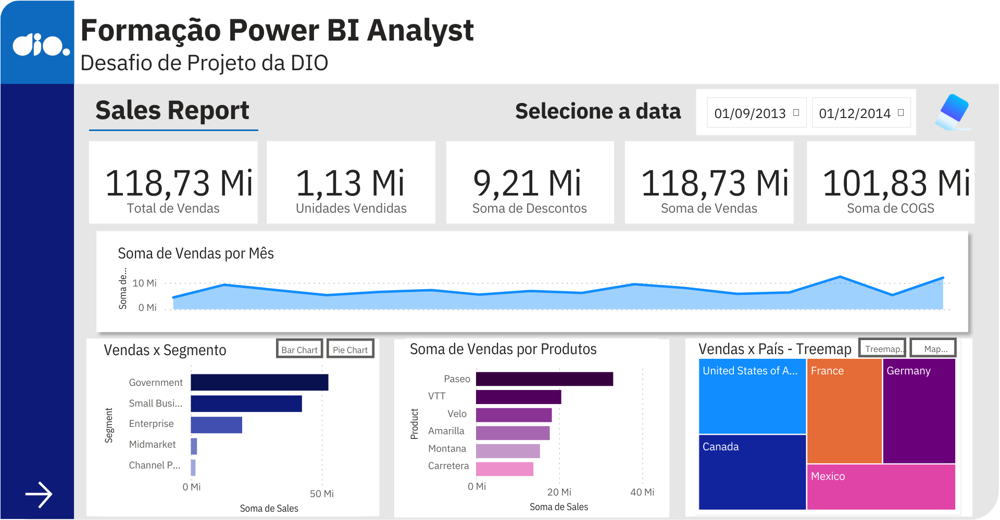
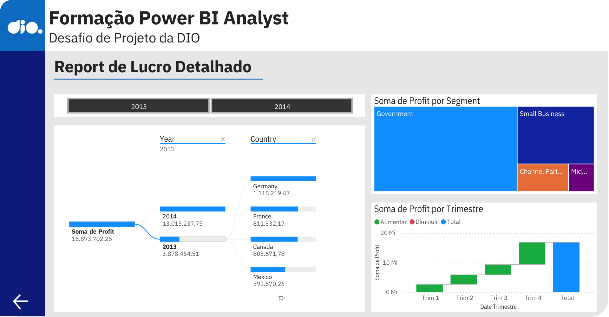
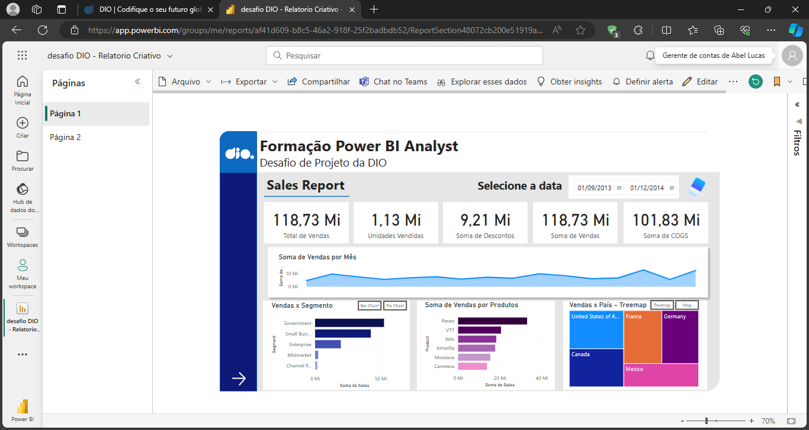
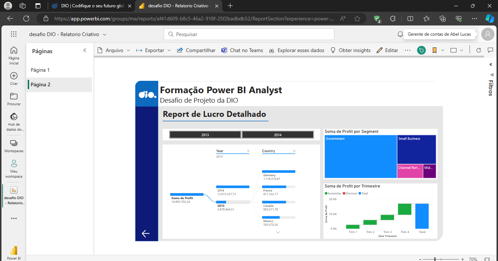

## power_bi_analyst: Relatório de Vendas Elegante com Power BI
### Sobre o projeto

Este projeto visa criar um relatório refinado com dados financeiros no Power BI, utilizando os arquivos disponíveis  [aqui](https://github.com/julianazanelatto/power_bi_analyst). Serão implementados botões de navegação, segmentadores e indicadores para facilitar a interação e análise dos dados. Além disso, será criada uma segunda página para oferecer uma experiência completa ao usuário. Ao combinar a sofisticação na apresentação dos dados com a funcionalidade dos recursos interativos, o objetivo é fornecer ao usuário uma ferramenta robusta e intuitiva para explorar e compreender os dados financeiros de forma eficaz.

### Objetivos

<ul>
    <li>Estruturar o relatório de forma clara e organizada.</li>
    <li>Implementar botões de navegação para facilitar a interação.</li>
    <li>Utilizar segmentadores e botões com imagens.</li>
    <li>Aplicar indicadores e botões para selecionar diferentes visuais.</li>
    <li>Criar uma segunda página para o relatório.</li>
</ul>

### Resultado
  
  

  
  

